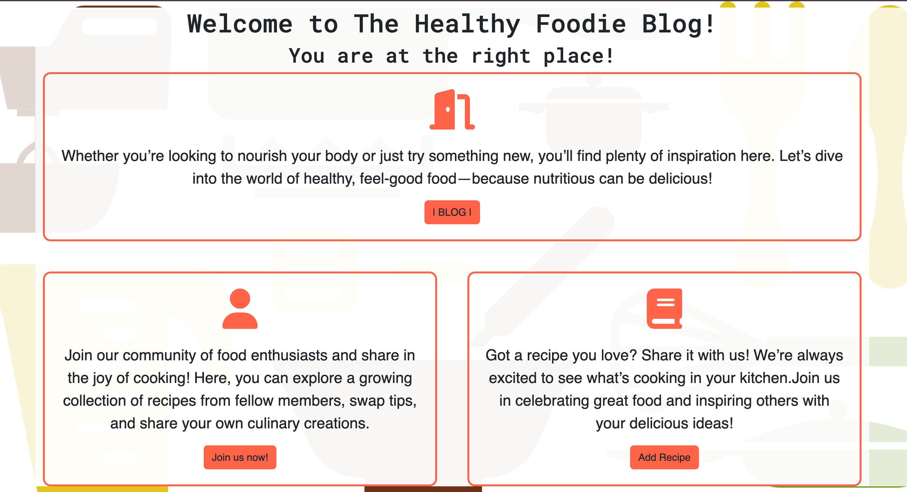
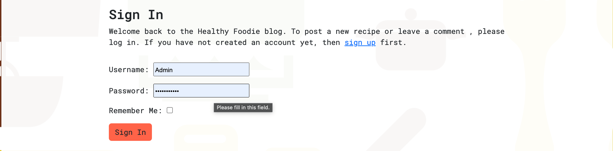
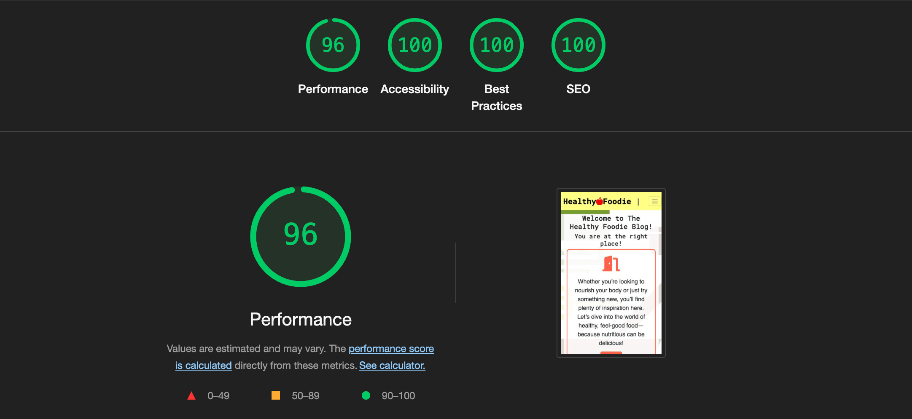

# Healthy Foodie Blog


Healthy Foodie blog is a space for healthy food lovers to explore, create, share and enjoy meals. Only registered users can add recipes and add comments.


- Live Website [Healthy Foodie](https://healthy-foodie-eea32bb0021f.herokuapp.com/)


## Table of contents
- [Agile Methodology](#agile-methodology)
- [UX](#UX)
   - [Site Purpose](#site-purpose)
   - [Audience](#audience)
   - [User Experience](#user-experience)
   - [Future Goals](#future-goals)
   
- [Design](#design)
   - [Database Schema](#database-schema)
   - [Colour Scheme](#colour-scheme)
   - [Typography](#typography)
   - [Icons](#icons)
- [Features](#features)
   - [Navigation](#navigation)
   - [Footer](#footer)
   - [Landing Page](#landing-page)
   - [Blog Page](#blog-page)
   - [Add Recipe](#add-recipe)
   - [Detail View Page](#detail-view-page)
      - [Recipe Detail View](#recipe-detail-view)
      - [Comment Section](#comment-section)
   - [Update View/Delete View](#update-view--delete-view)
      - [Edit Recipe](#edit-recipe)
      - [Delete Recipe](#delete-recipe)
   - [Register](#register)
   - [Sign In](#sign-in)
   - [Sign Out](#sign-out)
   - [404](#404-page)
   
- [Testing](#testing)
   - [Code Validation](#code-validation)
      - [HTML](#html)
      - [CSS](#css-testing)
      - [Python](#python)
      - [Lighthouse Testing](#lighthouse-testing)
      - [Bugs](#bugs)
- [Technologies Used](#technologies-used)
   - [Languages](#languages)
   - [Libraries and Frameworks](#libraries-and-frameworks)
   - [Tools](#tools)
- [Deployment](#deployment)
- [Credits](#credits)
- [Media](#media)
- [Acknowledgements](#acknowledgements)


## Agile Methodology

The plan for this website was carried out using Agine Methodology. GitHub Issues, which can be viewed [here](https://github.com/DianaStrahilova/Healthy-Foodie-Blog-PP4/issues?q=is%3Aissue+is%3Aclosed).

Each User Story contains Acceptance Criteria and Tasks. I had to add an extra user story after I initially created them.
Since this was my first project using Agile and Django, it was very challenging. Some of the tasks were completed faster than anticipated, while others took much longer.

After all, I found using the Agile Methodology of a benefit, as it helped me organize the development of the project.

## UX
### Site Purpose:
The purpose of the website is for people who are health-conscious food lovers to connect and share their recipes and feedback.

### Audience:
- Health-Conscious Individuals: People who are mindful of their diet and seek nutritious meals to support a healthy lifestyle.
- Busy Professionals: Those with limited time who want quick, healthy recipes to fit into a hectic schedule.
- Diet-Specific Followers: Individuals with dietary needs (e.g., gluten-free, vegan, keto) looking for new recipes that fit their preferences.
- Fitness Enthusiasts and Athletes: People who need nutrient-dense meals to support their training and physical goals.
- Young Adults and Families: Those interested in developing lifelong healthy eating habits for themselves or their families.
- Food Explorers: Curious food lovers eager to try innovative recipes or unique ingredients with a healthy twist.
- Weight Management Seekers: Individuals aiming to manage or lose weight healthily by discovering wholesome, lower-calorie recipes.

This diverse audience values taste, convenience, and quality nutrition, often searching for inspiring, easy-to-follow content that makes healthy eating feel accessible and enjoyable.


### User Experience:
What user would expect from interecting with the website.

#### As an Admin:
- As an admin, I can create, read, update and delete posts so I can manage my blog content.
- As an admin, I can approve or disapprove posts so that I can manage the content on my blog.
- As an admin, I can approve or dissaprove comments so I can filter out objectionable comments.

#### As a site user:
- As a Site User, I can register an account so that I can view, comment and create new posts.
- As a Site User, I can click on a post so that I can read the full text.
- As a site user, I can create a new post so that I can share my content with other users.
- As a site user, I can view a paginated list of posts so that I can select which post I want to view.
- As a Site User, I can modify or delete my posts so that I can manage my content.
- As a site user, I can I can leave comments on a post so that I can be involved in the conversation.
- As a Site User, I can modify or delete my comment on a post so that I can be involved in the conversation.


### Future Goals:
 - For future goals I would like to add a User Profile page with options for avatar and bio.


[Back to top](#table-of-contents)

## Design
     
  The website is responsive on screens from 320px and up.

  The Navigation Menu displays the Healthy Foodie logo and a hamburger button (on smaller devices) with links to the Home, Blog, Add Recipe. Register and Login only if user isn't logged in. And logout when user is logged in.

  Users can add a recipe or leave comments only if they're logged in.

  The footer displays social media links and is also repeated across all pages.

   #### Database Schema:

  - The database schema for this project is one-to-many. 
      - Each recipe can have multiple comments.
      - Each user can perform multiple intercations.

      


   #### Colour Scheme 

   


   #### Typography 

   Roboto, Poppins and fall back sans-serif were used throughout the website.

   #### Icons

   [uxwing](https://uxwing.com/) social media icons were used for the Footer. They are used as interactive links and have an aria-label which gives the relevant information to screen readers to read out to the users.


[Back to top](#table-of-contents)

## Features

   ### Navigation

   Featured on all pages, the fully responsive navigation includes:

   - A link to the Logo which brings the user to the home page.
   - A hamburger button on mobile which opens up a navigation list with links to Home, Blog, Add Recipe, Logout when user is logged in.
   - When user is not logged in Home, Blog, Add Recipe, Register, Login. If user clicks Add Recipe, in this case will be redirected to the register page.
   
   ### Footer
   Featured on all pages, the fully responsive footer includes:

   - Social Media Links.
   - Social links open in a new tab so that users are not directed away from the website.
   - A Simple Copyright disclaimer shown at the bottom of the footer.
   - All links have a pointer cursor to help users identify them as links.


   
   
   

   ### Landing Page:

   The Home page includes a heading with the blog name. It engages the user to join and share their recipes. Includes links to Sign Up and Add Recipe pages.

   

   ### Blog Page:
   - The Blog page displays paginated list with the latest posts(recipes). Each post is displayed as a card, containing the post image, title (as a clickable link), author and the date it was created on.

   


   ### Add Recipe

  - Only registered users can add recipes. All recipes must first be approved by the admin.
  - The recipe page consists of the recipe model form including summernote fields so the user could customise their recipes.
  - When users click on the 'Add Recipe' button, they get an alert 'Your recipe will be submitted for aopproval'.
  - The form is consistent with the website's style.
  - If image isn't upladed, there is a default image.

  All uploaded images are stored in [Cloudinary](https://cloudinary.com/)

  


   ### Detail View Page:

   #### Recipe Detail View:

   By clicking on the title link, the user is taken to the full recipe page, where they can see the full content of the recipe.
   - Only logged in users can view the comment section.
   - Edit/Delete buttons are only available if the user is the author of the recipe.

   


   #### Comment Section
   The detail view page also contains a scroll with the comments for the relevant recipe and a comment form to leave a comment.
   It has a full CRUD functionality.
      - Non regitered users cannot view the comment section.
      - Registered users can view and post comments.
      - Registered users can edit or delete their comments. 
      - If comment is not approved, it is only visible to it's author and contains a 'Pending' badge. Once it's approved, the badge is gone.
      - Logged in users can edit and delete their own comments.

   


   ### Update View / Delete View
   Detail recipe view contains edit and delete buttons only available to it's author. They lead to the relevant pages for edit/delete.

   

   #### Edit Recipe
  
  By clicking on the 'Edit' button, the user is brought to the edit recipe page, where they can update their recipe.
  The page contains a summernote field for better user experience.

  


  #### Delete Recipe 

  By clicking on the 'Delete' button, the user is asked to confirm deletion.

  


   ### Register 

   - The fully responsive registration form can be accessed from the navigation bar or when non-registered/logged in  user clicks on 'Add recipe' link.
   - It uses django-allouth to provide all the settings for user authentication and includes the fields below:
      - Username(unique)
      - Email (optional)
      - Password
      - Repeat Password
   - The reister page styles match the rest of the website.

  


  ### Sign In 
  The sign in form can be accessed from the navigation bar.
   - It includes a welcome message and a link to the Register form for user who have not registered yet.
   - A message on successful sign in  shown underneath Navbar.
   - It uses django-allouth to provide all the settings for user authentication and includes the fields below:
      - Username
      - Password

  


  ### Sign Out 
  The website has the functionality for a logged in user to log out.
  - The Logout form can only be accessed from the navigation bar and only when the user is logged in.
  - It confirms with the logged in user that they want to log out.
  - The Sign Out button logs out the users and directs them back to the Home page.
  - A message on successful logout shown underneath Navbar.


  

 ### 404 Page
 The 404 page is displayed when user tries to reach a non-existent page on the website. 
 

[Back to top](#table-of-contents)

## Testing 

I have performed only manual testing for this project, however automated testing will be considered or implemented in future.

### Code Validation
   #### HTML
   HTML code was tested using the [W3C Validator](https://validator.w3.org/) via URI input.

   - Home Page
      - No errors returned.

      

   - Blog Page
      - No errors returned.

      

   - Add Recipe 
      - No errors returned.

      

   - Recipe Detail
      - No errors returned.

      

   - Edit Recipe 
      - Some errors coming from the summernote field returned. I could not fix them. However it is a better user experince having the field. 

      
   - Delete Recipe 
      - No errors returned.

      

   - Login
      - No errors returned.
      
   - Log Out
       - No errors returned.
      
     
   
   #### CSS Testing
   CSS code was tested using the [W3C CSS Validation Service](https://jigsaw.w3.org/css-validator/) via text input.
   - No errors returned.
      

   
   #### Python 
   Python code was tested using [Code Institute's Python Linter](https://pep8ci.herokuapp.com/)

   - settings.py

   Line too long warning for lines: 115, 124, 127, 130, 133. I did not make any alterations as it is Django code.

   

   - urls.py

   

   - admin.py

   

   - forms.py 

   

   - models.py

   

   - views.py

   


   #### Lighthouse Testing
   [Lighthouse](https://developer.chrome.com/docs/lighthouse/overview/) was used to audit the website for performance, accessibility, best practices and SEO. It was run in Chrome DevTools in incognito mode.

   


### Bugs

- When I initially made the Recipe model I didn't include a slug field. Later on while I was creating the recipe detail view I decided I need to add it to the model. After adding it I encountered 'slug already exists' error, because I already had data in the database. Tried adding the slugfield as 'Description' field on 'Add Recipe' and it worked for a while until it started showing the same error again. After trying a lot of different ways to implement it, I came across [this article](https://stackoverflow.com/questions/29293096/change-slug-in-django-use-slugify) on [StackOverflow](https://stackoverflow.com/) and realised it is my mistake because I had it set to unique. I changed it up and on approval I can create the slug.

- Got a lot of 'Template Not Found' error, which was also my mistake as I had set the project name instead to the app name.
- Bootstrap5 CSS is used for this project, however later on in the development I have noticed the jquery and npm script tags are two different versions. When I change to different versions, my navbar would not collapse. Left it as it is.
- CSS style sheet was not updating even after hard refreshing. [This article](https://stackoverflow.com/questions/52682812/django-css-not-updating) helped me to fix it.


### Remaining Bugs

- No bugs remaining as far as I know.

[Back to top](#table-of-contents)

## Technologies Used

### Languages
- [HTML5](https://www.w3schools.com/html/)
- [CSS3](https://www.w3schools.com/css/css_intro.asp)
- [Python](https://www.w3schools.com/python/default.asp)

### Libraries and Frameworks

- [Django 4.2.16](https://www.djangoproject.com/) - Free and open source Python Web Framework.
- [Gunicorn 20.1.0](https://gunicorn.org/) - A Python WSGI HTTP server compatible with Django and used to run the project on Heroku.
- [PostgreSQL 0.5.1](https://www.postgresql.org/) - A powerful, open-source object-relational database system.
- [Psycopg2 2.9.10](https://www.psycopg.org/docs/) - A PostgreSQL database adapter for Python.
- [Heroku](https://dashboard.heroku.com/apps) - A cloud platform as a service.
- [Django Allauth](https://django-allauth.readthedocs.io/en/latest/) - Integrated set of Django applications addressing authentication and registration.
- [Bootstrap5](https://getbootstrap.com/docs/5.3/getting-started/download/) - A Framework for building responsive, mobile-fist sites.
- [whitenoise==5.3.0](https://whitenoise.readthedocs.io/en/latest/) - WhiteNoise is used for serving static files in a Django application.
- [sqlparse==0.5.1](https://pypi.org/project/sqlparse/) - SQLParse is a library used for parsing SQL queries in Python.
- [django-summernote==0.8.20.0](https://pypi.org/project/django-summernote/) - Summernote is a JavaScript library that helps you create WYSIWYG editors with a simple and easy-to-use interface.
- [Cloudinary](https://cloudinary.com/) - To store the uploaded images.
- [django-crispy-forms==2.3](https://django-crispy-forms.readthedocs.io/en/latest/) - To safely render the django forms. 


### Tools 
- [GitHub](https://github.com/) - To store the repository for submission.
- [GitPod](https://www.gitpod.io/) - As coding environment.
- [Code Institute template](https://stackoverflow.com/questions/2084508/clear-the-terminal-in-python) for GitPod and this README.
- [Am I Responsive](https://ui.dev/amiresponsive) - For responsive visuals of the website.
- [W3C Validator](https://validator.w3.org/) - A validator which checks the markup validity of Web documents in HTML, XHTML, SMIL, MathML, etc.
- [W3C CSS Validation Service ](https://jigsaw.w3.org/css-validator/) - A validator which checks the validity of CSS code.
- [CI PEP8 Online](https://pep8ci.herokuapp.com/) - Code Institute's Python Linter. Highlights syntactical and stylistic problems in Python source code.
- [Chrome Dev Tools](https://developer.chrome.com/docs/devtools/) - Web Developer Tools.
- [TinyPng](https://tinypng.com/) - Compresses images to reduse the file size.
- [Coolors](https://coolors.co/) - Colour Palette Generator.
- [Google Fonts](https://fonts.google.com/) - Fonts.
- [DrawSql](https://drawsql.app/) - For creating the database schema.
- [Favicon Generator](https://favicon.io/favicon-converter/) - to generate the favicon.


### Content and Media 
- [UXwing](https://uxwing.com/) - Social Media Icons
- [Font Awesome](https://fontawesome.com/) - Icons
- [Free Images](https://www.freeimages.com/) - For the default upload image.
- [CleanPNG](https://www.cleanpng.com/) - For the background image of the website.
- [PNGWing](https://www.pngwing.com/#google_vignette) - favicon.


[Back to top](#table-of-contents)


## Deployment
For good practice, this project was deployed early on [Heroku](https://dashboard.heroku.com/).

   <details>

<summary>Setting up a Django project and deploying to Heroku</summary>

#### Create Repository

- Create a new repository in GitHub using the [Code Institute Template](https://github.com/Code-Institute-Org/ci-full-template) and clone it locally folowing [these instructions](https://docs.github.com/en/repositories/creating-and-managing-repositories/cloning-a-repository)
- 

#### Setting up the workspace
- Install Django and gunicorn
   -  ```ruby
         pip3 install Django~=4.2.1

- Create a project 
   -  ```ruby
         django-admin startproject PROJECT_NAME
   
- Create an app 
   - ```ruby
         python3 manage.py startapp APP_NAME
     ```
#### Create Database:
1. [PostgreSQL from Code Institute](https://dbs.ci-dbs.net/)

2. Generate a file named env.py and add it to .gitignore. I used the CI Template and the file was there already.
      ```ruby
            touch env.py
      ```

3. Inside env.py:
      ```ruby
      import os

      os.environ.setdefault("DATABASE_URL", "<your-database-URL>")
      ```
4. The Django application requires a SECRET_KEY to encrypt session cookies. Set this variable to any string you like or generate a      secret key os.environ[“SECRET_KEY”] = ”SecretKey”

   -  Install the two required packages to connect to PostgreSQL database:
      ```ruby
      pip3 install dj-database-url~=0.5 psycopg2~=2.9
      pip3 freeze --local > requirements.txt
      ```
#### Modify settings.py

1. In PROJECT_NAME/settings.py connect settings.py file to env.py
      ```ruby
      import os
      import dj_database_url
      if os.path.isfile('env.py'):
          import env
      ```
2. Remove the insecure secret ket provided by django and reference the env.py file created earlier:
      ```ruby
      SECRET_KEY = os.environ.get(‘SECRET_KEY’)
      ```
3. Connect the database using the dj_database_url import.
      ```ruby
      DATABASES = {
      'default': dj_database_url.parse(os.environ.get("DATABASE_URL"))
      }
      ```
#### Connect the database to Heroku 
   
1. Open up the Heroku dashboard, select the project’s app and click on the ‘Settings’ tab.
2. Click on ‘Reveal Config Vars’ and add the DATABASE_URL with the value of the copied URL from the database instance created on CI database.
3. Add the SECRET_KEY with the value of the secret key added to the env.py file.
4. If using gitpod another key needs to be added in order for the deployment to succeed. This is PORT with the value of 8000.

#### Setup the Templates Directory

In settings.py, add the following under BASE_DIR DIRS = os.path.join(BASE_DIR, "templates")

 #### Add the Heroku Host Name
In settings.py scroll to ALLOWED_HOSTS and add the Heroku host name. This should be the Heroku app name created earlier followed by .herokuapp.com. Add in ’localhost’ so that it can be run locally.
   
   ```ruby
      ALLOWED_HOSTS = [‘.herokuapp.com’, ‘localhost’]
   ```

#### Store Static and Media Files on Cloudinary
Have a Cloudinary accoount.

1. In Cloudinary:
    - Copy CLOUDINARY_URL from Cloudinary Dashboard
2. In env.py:
    - Add CLOUDINARY_URL to env.py NOTE: Paste in correct section of the link:
      ```ruby
         os.environ["CLOUDINARY_URL"] = "cloudinary://*********"
      ```
3. In Heroku:
    - Add Cloudinary URL to Heroku Config Vars (settings tab) NOTE: Paste in correct section of the link: CLOUDINARY_URL, cloudinary://*********
    - Add DISABLE_COLLECTSTATIC to Heroku Config Vars (this will be removed for deployment): DISABLE_COLLECTSTATIC, 1
4. In settings.py:
    - Add Cloudinary Libraries to installed apps NOTE: Order is important!
      ```ruby
         INSTALLED_APPS = [ ..., **'cloudinary_storage'**, 'django.contrib.staticfiles', 'cloudinary', ..., ]
      ```
   - Tell Django to use Cloudinary to store media and static files by placing this snippet under the comments indicated below:
      ```ruby
      STATIC_URL = '/static/'
      STATICFILES_STORAGE = 'cloudinary_storage.storage.StaticHashedCloudinaryStorage'
      STATICFILES_DIRS = [os.path.join(BASE_DIR, 'static/')]
      STATIC_ROOT = os.path.join(BASE_DIR, 'staticfiles')

      MEDIA_URL = '/media/'
      DEFAULT_FILE_STORAGE = 'cloudinary_storage.storage.MediaCloudinaryStorage'
      ```

#### Create the Directories and the Process File

1. Create the media, static and templates directories at the top level next to the manage.py file.
2. At the same level create a new file called ‘Procfile’ with a capital ‘P’. This tells Heroku how to run this project.
3. Add the following code, including the name of your project directory"
   ```ruby
      web: gunicorn healthy_foodie.wsgi
   ```
   - ‘gunicorn’ is the server used.
   - ‘wsgi’, stands for web services gateway interface and is a standard that allows Python services to integrate with web servers.
4. Save everything and push to GitHub.

#### First Deployment

1. Go back to the Heroku dashboard and click on the ‘Deploy’ tab.
2. For deployment method, select ‘GitHub’ and search for the project’s repository from the list.
3. Select and then click on ‘Deploy Branch’.
4. When the build log is complete it should say that the app has been successfully deployed.
5. Click on the ‘Open App’ button to view it and the Django “The install worked successfully!” page, should be displayed.

#### Final Deployment

1. Set Debug to False.
2. Commit and push your code to your project's repository.
3. Navigate to the 'Deploy' tab and scroll down to 'Deploy a GitHub branch'.
4. Select the branch you want to deploy and click on the 'Deploy branch' button. When the app is deployed, you should see a message in the built log saying "Your app was successfully deployed". Click 'View' to see the deployed app in the browser. Alternatively, you can click on the 'Open App' button at the top of the page.

</details>


## Credits 
#### Code
 The following walkthroughs helped me shape my project.

 - Code Institute's "I Think Therefore I Am Blog" which is found in the CI's LMS for the Diploma in Software Development.
 - CodingEntrepreneurs - [Class Based Views - CreateView and UpdateView](https://www.youtube.com/watch?v=KB_wDXBwhUA&list=PLEsfXFp6DpzTD1BD1aWNxS2Ep06vIkaeW&index=38).
 - Dee Mc's -  [How to create a recipe blog](https://www.youtube.com/watch?v=sBjbty691eI&list=PLXuTq6OsqZjbCSfiLNb2f1FOs8viArjWy)
 - Dave Gray - [Python Django Pages, URLs & Slugs](https://www.youtube.com/watch?v=csmEzyVeRIE&t=737s).

 Pages I referred to a lot:
 - [Django Documentation](https://docs.djangoproject.com/en/5.1/).
 - [Django Crispy Forms Docs](https://django-crispy-forms.readthedocs.io/en/latest/).
 - [Bootstrap Docs](https://getbootstrap.com/docs/4.1/getting-started/introduction/).
 - [Django Views](https://docs.djangoproject.com/en/5.1/ref/class-based-views/generic-editing/).
 - [Summernote](https://summernote.org/deep-dive/#google_vignette).
 - [Stack Overflow](https://stackoverflow.com/).
 - [ChatGPT](https://chatgpt.com/) - for documentation.

 #### Media 
  <details>

<summary>Recipes</summary>

#### Recipes and images currently on the website

- [Strawberry Banana Smoothie](https://downshiftology.com/recipes/strawberry-banana-smoothie/)
- [Oatmeal Cookies](https://www.loveandlemons.com/oatmeal-cookies/)
- [Salmon Bowl](https://www.deliciousmagazine.co.uk/recipes/salmon-and-avocado-rice-bowl/)
- [Banana Waffles Image](https://healthfulblondie.com/flourless-banana-oat-waffles/)
- [Overnight Oats](https://feelgoodfoodie.net/recipe/overnight-oats/)
- [Banana Bread](https://www.bbcgoodfood.com/recipes/brilliant-banana-loaf)
- Meatballs is a credit to my mentor.

</details>


## Acknowledgements

- To my awesome new mentor, Richard Wells! For being such a fantastic mentor, for the guidance, support and advice.

[Back to top](#table-of-contents)


