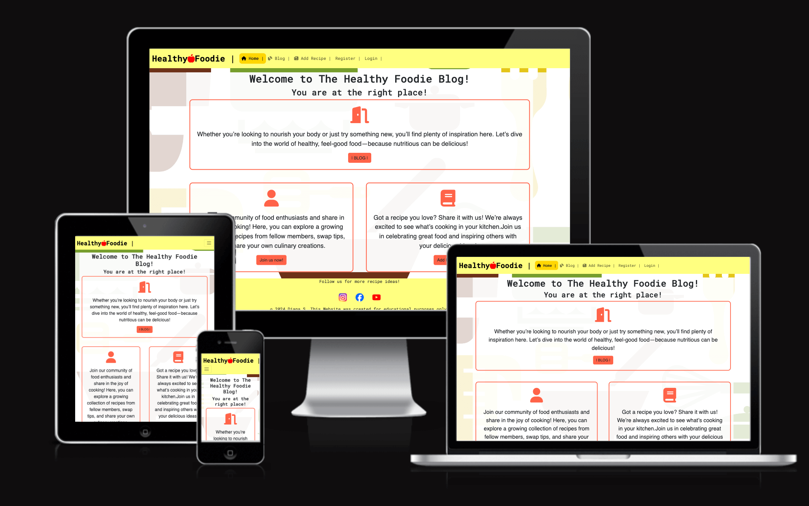
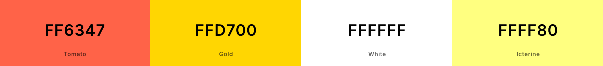
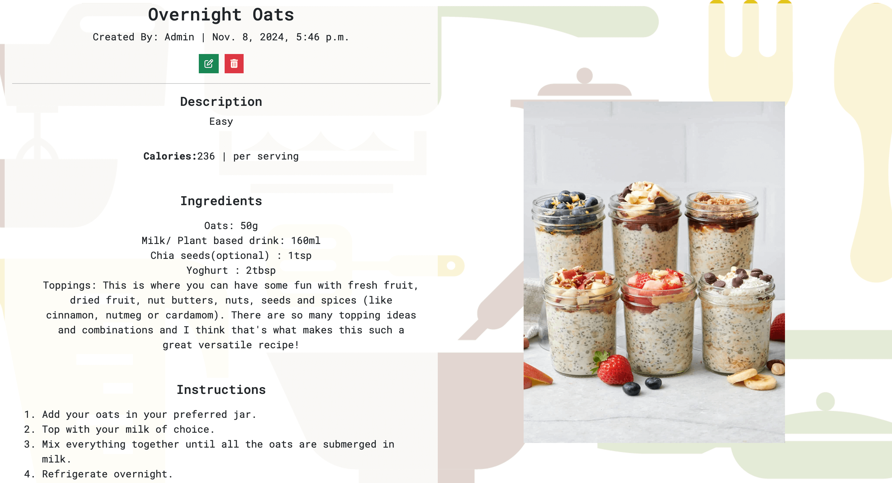

# Healthy Foodie Blog

Healthy Foodie blog is a space for healthy food lovers to explore, create, share and enjoy meals. Only registered users can add recipes and add comments.

- Live Website [Healthy Foodie](https://healthy-foodie-eea32bb0021f.herokuapp.com/)

## Table of contents
- [Agile Methodology](#agile-methodology)
- [UX](#UX)
   - [Site Purpose](#site-purpose)
   - [Audience](#audience)
   - [Communication](#communication)
   - [Future Goals](#future-goals)
   
- [Design](#design)
   - [Database Schema](#database-schema)
   - [Colour Scheme](#colour-scheme)
   - [Typography](#typography)
   - [Icons](#icons)
- [Features](#features)
   - [Navigation](#navigation)
   - [Blog Page](#blog-page)
   - [Recipe View](#recipe-view)
   - 
   - 
- [Testing](#testing)
   - [Validator Testing](#validator-testing)
   - [Manual Testing](#manual-testing)
   - [Bugs](#bugs)
   - [Remaining Bugs](#remaining-bugs)
- [Technologies Used](#technologies-used)
   - [Main Language](#main-langoage)
   - [Frameworks, Libraries and Programs](#frameworks-libraries-and-programs)
- [Deployment](#deployment)
   - [Version Control](#version-control)
   - [Page Deployment](#page-deployment)
- [Credits](#credits)

## Agile Methodology

The plan for this website was carried out using Agine Methodology. GitHub Issues, which can be viewed [here](https://github.com/DianaStrahilova/Healthy-Foodie-Blog-PP4/issues?q=is%3Aissue+is%3Aclosed).

Each User Story contains Acceptance Criteria and Tasks. I had to add an extra user story after I initially created them.
Since this was my first project using Agile and Django, it was very challenging. Some of the tasks were completed faster than anticipated, while others took much longer.

After all, I found using the Agile Methodology of a benefit, as it helped me organize the development of the project.

## UX
### Site Purpose:
The purpose of the website is for people who are health-conscious food lovers to connect and share their recipes and feedback.

### Audience:
- Health-Conscious Individuals: People who are mindful of their diet and seek nutritious meals to support a healthy lifestyle.
- Busy Professionals: Those with limited time who want quick, healthy recipes to fit into a hectic schedule.
- Diet-Specific Followers: Individuals with dietary needs (e.g., gluten-free, vegan, keto) looking for new recipes that fit their preferences.
- Fitness Enthusiasts and Athletes: People who need nutrient-dense meals to support their training and physical goals.
- Young Adults and Families: Those interested in developing lifelong healthy eating habits for themselves or their families.
- Food Explorers: Curious food lovers eager to try innovative recipes or unique ingredients with a healthy twist.
- Weight Management Seekers: Individuals aiming to manage or lose weight healthily by discovering wholesome, lower-calorie recipes.

This diverse audience values taste, convenience, and quality nutrition, often searching for inspiring, easy-to-follow content that makes healthy eating feel accessible and enjoyable.

### User Experience:
What user would expect from interecting with the website.

#### As an Admin:
- As an admin, I can create, read, update and delete posts so I can manage my blog content.
- As an admin, I can approve or disapprove posts so that I can manage the content on my blog.
- As an admin, I can approve or dissaprove comments so I can filter out objectionable comments.

#### As a site user:
- As a Site User, I can register an account so that I can view, comment and create new posts.
- As a Site User, I can click on a post so that I can read the full text.
- As a site user, I can create a new post so that I can share my content with other users.
- As a site user, I can view a paginated list of posts so that I can select which post I want to view.
- As a Site User, I can modify or delete my posts so that I can manage my content.
- As a site user, I can I can leave comments on a post so that I can be involved in the conversation.
- As a Site User, I can modify or delete my comment on a post so that I can be involved in the conversation.

### Future Goals:
For future goals I would like to add a User Profile page.

[Back to top](#table-of-contents)

## Design
     
  The website is responsive on screens from 320px and up.

  The Navigation Menu displays the Healthy Foodie logo and a hamburger button (on smaller devices) with links to the Home, Blog, Add Recipe. Register and Login only if user isn't logged in. And logout when user is logged in.

  Users can add a recipe or leave comments only if they're logged in.

  The footer displays social media links and is also repeated across all pages.

   #### Database Schema:

  - The database schema for this project is one-to-many. 
      - Each recipe can have multiple comments.
      - Each user can perform multiple intercations.

      

   #### Colour Scheme 

   

   #### Typography 

   Roboto, Poppins and fall back sans-serif were used throughout the website.

   #### Icons

   [uxwing](https://uxwing.com/) social media icons were used for the Footer. They are used as interactive links and have an aria-label which gives the relevant information to screen readers to read out to the users.

[Back to top](#table-of-contents)

## Features

   ### Navigation

   Featured on all pages, the fully responsive navigation includes:

   - A link to the Logo which brings the user to the home page.
   - A hamburger button on mobile which opens up a navigation list with links to Home, Blog, Add Recipe, Logout when user is logged in.
   - When user is not logged in Home, Blog, Add Recipe, Register, Login. If user clicks Add Recipe, in this case will be redirected to the register page.
   
   ### Footer
   Featured on all pages, the fully responsive footer includes:

   - Social Media Links.
   - Social links open in a new tab so that users are not directed away from the website.
   - A Simple Copyright disclaimer shown at the bottom of the footer.
   - All links have a pointer cursor to help users identify them as links.

   
   
   

   ### Landing Page:

   The Home page includes a heading with the blog name. It engages the user to join and share their recipes. Includes links to Sign Up and Add Recipe pages.

   

   ### Blog Page:
   The Blog page displays paginated list with the latest posts(recipes). Each post is displayed as a card, containing the post image, title (as a clickable link), author and the date it was created on.

     -- Blog page image ...

   ### Add Recipe

  Only registered users can add recipes. All recipes must first be approved by the admin.

  

   ### Detail View Page:

   #### Recipe Detail View:

   By clicking on the title link, the user is taken to the full recipe page, where they can see the full content of the recipe.

   

   #### Comment Section
   The detail view page also contains a scroll with the comments for the relevant recipe and a comment form to leave a comment.
   It has a full CRUD functionality.
      - Non regitered users cannot view the comment section.
      - Registered users can view and post comments.
      - Registered users can edit or delete their comments. 
      - If comment is not approved, it is only visible to it's author and contains a 'Pending' badge. Once it's approved, the badge is gone.
      - Logged in users can edit and delete their own comments.

   

   ### Update View / Delete View
   The detail recipe view contains edit and delete buttons only available to it's author. They lead to the relevant pages for edit/delete.

   

   #### Edit Recipe
  
  By clicking on the edit button, the user is brought to the edit recipe page, where they can update their recipe.
  The page contains a summernote field for better user experience.

  

  #### Delete Recipe 

  By clicking on the 'Delete' button, the user is asked to confirm deletion.

  

   ### Register 
  Register Page 

  

  ### Sign In 

  

  ### Sign Out 

  

 ### 404 Page
 

## Testing 

I have performed only manual testing for this project, however automated testing will be considered or implemented in future.

### Code Validation
   #### HTML
   - Home Page
      - No errors returned.

      

   - Blog Page
      - No errors returned.

      

   - Add Recipe 
      - No errors returned.

      

   - Recipe Detail
      - No errors returned.

      

   - Edit Recipe 
      - Some errors coming from the summernote field returned. I could not fix them. However it is a better user experince having the field. 

      
   - Delete Recipe 
      - No errors returned.

      

   - Login
      - No errors returned.
      

  
   

  

## Testing 

### Validator Testing 
- [CI PEP8 Online](https://pep8ci.herokuapp.com/).
    - No errors were returned.

### Bugs

- 

- 

### Remaining Bugs

- No bugs remaining as far as I know.

[Back to top](#table-of-contents)

## Technologies Used

### Main Language
- Python

### Frameworks, Libraries and Programs

- [GitPod](https://www.gitpod.io/) - as coding environment.
- [GitHub](https://github.com/) - to store the repository for submission.
- [Draw.io](https://app.diagrams.net/) - to create the flowchart.
- [Heroku](https://dashboard.heroku.com/apps) - to deploy the project.
- [Am I Responsive](https://ui.dev/amiresponsive) - for the preview image at the top of the README.md.
- [Code Institute template](https://stackoverflow.com/questions/2084508/clear-the-terminal-in-python) for GitPod and this README.
- [CI PEP8 Online](https://pep8ci.herokuapp.com/) according to the PEP 8 style guide for validating the Python code.
- 
- 
- 

[Back to top](#table-of-contents)

## Deployment
   ### Version Control 

   The version control was maintained using git within GitPod VS Code workspace and push code to main repository.
   - From the VS Code terminal type "git add .", to make changes/updates to the files.
   - Type "git commit -m (insert a short message)", which commits the changes and updates the files.
   - Use "git push" command to push the commited changes to the main repository.

   ### Page Deployment

   The app was deployed to Heroku CLI. The steps are as follows:
   - After creating an account and signing in, click "New" to create a new app from the dashboard.
   - Create a unique name for the app and select region; press "Create app".
   - Go to "Settings" to navigate to "Config Vars."
   - Add Config Vars.
        - For this app was used: "KEY = PORT : VALUE = 8000". As stated in the README.md template for this project. 
   - Add buildpacks Python and NodeJS.
   - Click "Deploy Branch".
   - Scroll down to Deployment Method and select GitHub.
   - Select the repository to be deployed and connect to Heroku.
   - Scroll down to "Deploy":
        - Option 1 is selecting Automatic Deploys.
        - Option 2 is Manual Deploys, which was used for this project.
   
   Live deployment [Spooky Hangman](https://spooky-hangman-b6ee3e9202ec.herokuapp.com/)

[Back to top](#table-of-contents)

## Credits 

- 
- 
- 
- 

[Back to top](#table-of-contents)

## Acknowledgements

[Back to top](#table-of-contents)

